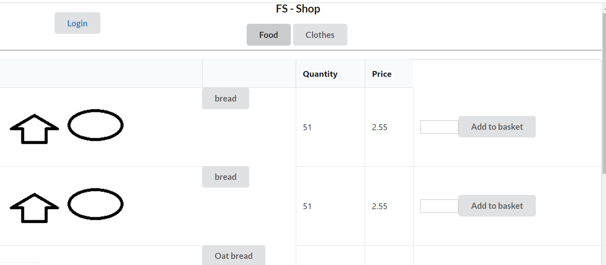

# FS-Shop

19.5.2020 

## Project goals
- To create imaginary WebShop in order to study MERN -stack
- Build a working set
- Publish the result in a cloud service

## Used FullStack components and technologies

- React
- NodeJS
- Express
- Redux
- MongoDB atlas
- Mongoose
- Heroku
- Git (GitHub)

Version numbers can be read from package.json

 ### Backend API-description for version 1.0.0 :

 * Products listing 
   
        http-method: GET,
        endpoint:/shop/products
        status: public
   

* User registration

        http-method:POST
        endpoint:/shop/user/register
        availability: public
        input: {
                nickname: $(4-14 chars)
                email: $(valid email format),
                password: $(8-64 chars, including one special char)
        }
        output:{
            success: http 200 ok + JSON-message
            error: http 422 in case of failure + JSON-message
        }
       

* User login

        http-method:POST
        endpoint:/shop/user/login
        availability: public
        input: {
                email: $(valid email format)
                password: $(8-64 chars, including one special char)
        }
        output:{
            success: http 200 ok + JSON-message
            error: http 422 or http 403 + JSON-message
        }
        additionalInfo: http header token is received

* User logout

        http-method:POST
        endpoint:/shop/user/logout
        availability: public
        input: {
              <http header token>: $(token from login)            
        },
        output:{
            success: http 200 ok + JSON-message
            error: http 400 JSON-message
        }

* Shopping confirmation

        http-method:POST
        endpoint:/shop/api/cashout
        availability: restricted for logged in users
        input: {
              <http header token>: $(token from login)
              <http body payload>: $(list of productIds and quantities)
        }
        output:{
            success: http 200 ok + JSON-message
            error: http 403 or http 422 JSON-message
        },        
        additionalInfo: After succesful service call the service returns the productIds which were accepted and quantities what are left in the storage

### Sample image during development selecting products

### Ideas for further development
* Admin user interface in which admin could control the products by adding, removing etc.
* Shopping history for users to view later on
* Verifying a given email in registration phase so that actual registration link would be sent to that email
* Automated storage control system: An (email) alert would be sent if product quantity in the storage would decrease under certain threshold
* Real money transactions could be considered if there were real products.

### Additional infos
 Images that final application shows are relative and referenced directly from Wikipedia server 

### Contributors
@dilled and @antsa-q